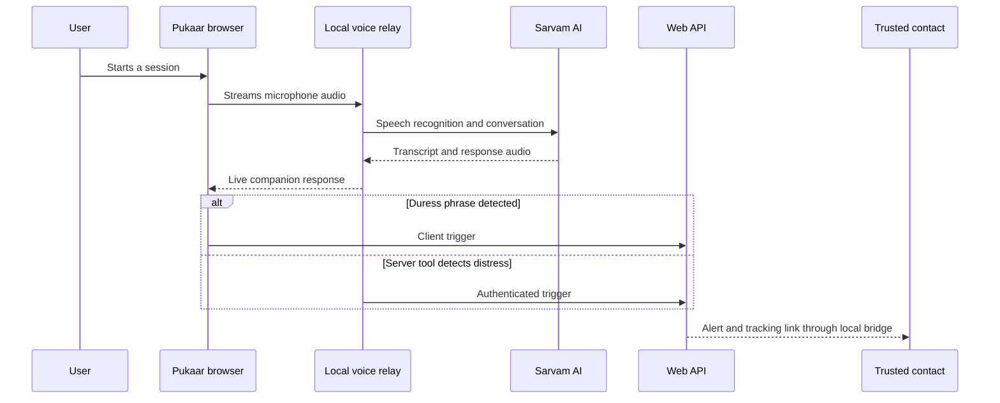

# Pukaar

Pukaar turns the call someone is already pretending to be on into a responsive safety companion. It carries a natural voice conversation, detects a private duress phrase through two paths, and prepares an alert with a live tracking link for trusted contacts.

## System



The repository is a pnpm and Turborepo monorepo. See [the architecture guide](docs/ARCHITECTURE.md) for service boundaries and the local-only deployment constraint.

## Start locally

Requirements: Node.js 22+, pnpm 9.15.9, a Firebase project, Sarvam API access, and Groq for open-ended product Q&A.

```bash
pnpm install --frozen-lockfile
pnpm dev:web
pnpm dev:relay
pnpm dev:wa
```

Copy `.env.example` into the app-specific ignored environment files and fill the documented variables. Never commit service-account JSON or local environment files.

## Verify

```bash
pnpm typecheck
pnpm lint
pnpm test
pnpm build
```

GitHub Actions runs the same checks for every pull request and every push to `master`.

## Deployment

`apps/web` is the Vercel project root with files outside the root included for workspace packages. Firestore is hosted in `asia-south1`. Voice and WhatsApp delivery remain local because Vercel cannot address services bound to the presenter laptop.

The hosted application demonstrates the product UI, grounded Q&A, and cloud-backed session APIs. The complete voice-to-alert flow must be run on localhost.

## Privacy and limitations

- Audio is processed by the voice provider but is not persisted by Pukaar in Firestore.
- Session documents carry an expiry timestamp; Firestore TTL deletion is asynchronous.
- Tracking links are read-only bearer links and should be shared only with trusted contacts.
- This prototype supplements emergency services. It does not guarantee prevention or response.
