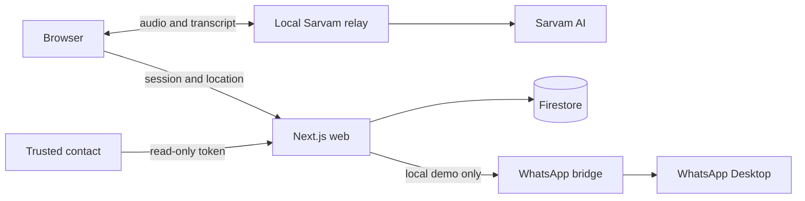

# Pukaar architecture

Pukaar is a browser demonstration of a conversational safety companion. The hosted web application presents the product and stores short-lived session state. The realtime Sarvam relay and WhatsApp Desktop bridge run on the demonstration laptop.

## Trust boundaries

- The browser owns microphone permission and keeps audio out of Firestore.
- The relay authenticates server-triggered alarms with `RELAY_SHARED_SECRET`.
- Tracking links contain a high-entropy read-only token.
- Firestore session documents use a six-hour TTL field. Expiry enforcement in application reads must remain independent of asynchronous TTL deletion.
- The deployed Vercel application cannot call services bound to the presenter laptop. Full voice and WhatsApp demonstrations therefore run on localhost.

## Runtime map

| Package | Runtime | Responsibility |
|---|---|---|
| `apps/web` | Next.js on Vercel or localhost | UI, session APIs, tracking, grounded product Q&A |
| `apps/relay` | Local Node.js | Sarvam realtime STT, conversation and TTS |
| `apps/wa-bridge` | Local Windows process | Serialized WhatsApp Desktop alert delivery |
| `packages/core` | Shared TypeScript | Duress matching, message construction, geo and cost logic |
| `packages/ui` | Shared CSS/TypeScript | Design tokens and utility composition |

## Local demonstration

Start the web app, relay and WhatsApp bridge in separate terminals. Confirm `/api/health`, grant microphone and location permission, create a session with an authorized test contact, then test the explicit alarm path before testing phrase detection. Do not use a real recipient without their permission.
