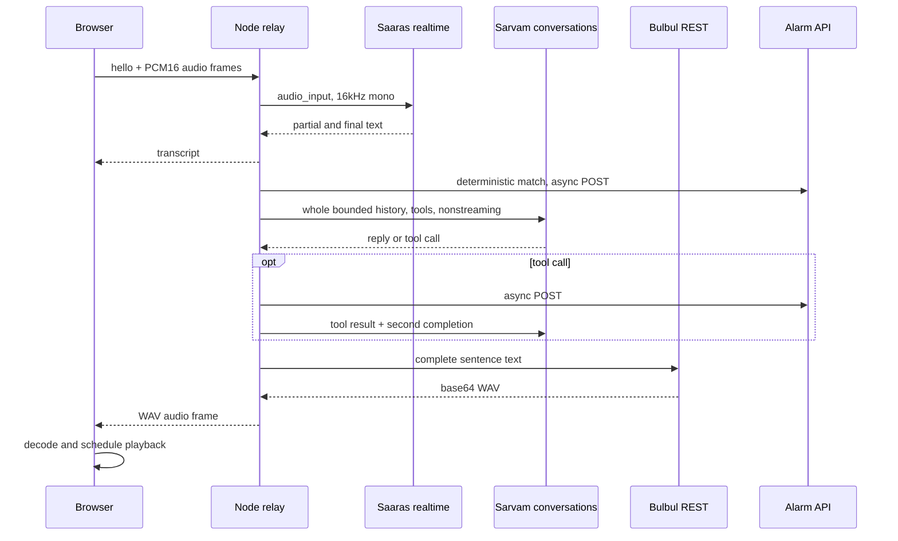

# Pukaar voice, alert and glass-orb audit

Date: 8 September 2026. Audience: Harsh and the agent implementing the repair plan.
Repository: `C:\Users\harsh\Desktop\HARSH\WEB-DEV-PROJECTS\nari-kavach`.
Baseline: `9ced54c`. Working tree was clean before this documentation work.

## Direct answer

Keep Sarvam and the web architecture. Repair observable failure states, transcript matching and turn management before changing providers. The current orb is already Three.js, but its framing clips the sphere and its lighting gives little depth. A controlled studio scene, restrained asymmetric geometry, audio-driven light movement and one persistent canvas address the actual visual problems.

The original failed WhatsApp attempt cannot be conclusively reconstructed from the retained records. A real bridge lock defect was reproduced independently: `getClipboard()` rejects outside the route's `try/finally`, leaving `busy=true`. The next request receives 409 indefinitely. This is a confirmed failure mode, not proof that clipboard contention caused the user's particular incident.

## Investigation performed

- Read repository instructions, README, architecture, relay session lifecycle, STT/chat/TTS adapters, persona, matcher, browser voice hooks, alarm API, WhatsApp adapter/worker, Firestore session/location/alert logic, SSE tracking, setup/call/home pages and all four orb components.
- Used Chrome to open the actual localhost home screen and inspect the rendered orb. It is horizontally centered in the inspected viewport, but visibly clipped along its canvas boundary. Vertical placement and the intro use different positioning systems.
- Checked localhost web, local WhatsApp bridge and public Vercel web health: all returned HTTP 200. Bridge reported WhatsApp running. Health is not a dispatch test.
- Compared selected environment values without printing keys: public origin points to Vercel, bridge points to loopback, relay points to localhost web, shared secrets match, voice is WS STT plus REST TTS with Simran.
- Read a limited set of recent Firestore records without printing names, phone numbers, tracking tokens or coordinates. The latest available session had four location points and no recorded alarm. One older alert record reported submission. There was no retained matching failure record to explain the reported incident.
- Read the latest session's SSE stream from both localhost and the public Vercel host: both returned HTTP 200 and an `update` event containing a trail. This proves this session was accessible at both origins at audit time. It does not prove every historical link worked.
- Ran the real matcher against the user's variations, and ran the bridge route with a mocked desktop dependency. No UI keystrokes, messages, calls, cloud writes or paid Sarvam requests were performed.
- Ran `pnpm test`: 43 core tests and 2 relay tests passed. The passing suite does not cover the confirmed failures below.

## Confirmed findings

| ID | Evidence in current code | Consequence | Confidence |
|---|---|---|---|
| A1 | `apps/wa-bridge/server.js`: `busy=true`, then `await wa.getClipboard()` before `try` | Clipboard read failure leaves bridge locked; mocked next request returns 409 | Reproduced |
| A2 | Same file: `await wa.setClipboard(clipboard)` before `busy=false` in finally | Clipboard restoration can also leave bridge locked | Code-confirmed |
| A3 | `apps/relay/src/session.ts`: sets `alarmRaised`, starts `void raiseAlarm`, immediately sends alarm frame | UI detects a phrase even if HTTP dispatch fails | Code-confirmed |
| A4 | `useLocalDuressSpotter.ts`: sets fired flag and calls callback before fire-and-forget fetch | Failed POST has no retry/result handling; detector stays latched | Code-confirmed |
| A5 | `/api/alarm`: writes raised state before dispatch; dedupes only for 15 seconds | Recorded trigger and actual submission are conflated; retry semantics are undefined | Code-confirmed |
| A6 | Call page polls results for about 45 seconds; web bridge fetch allows 60 seconds; batch has many sequential OS calls | UI can stop before result exists; no terminal timeout presentation | Code-confirmed |
| A7 | Bridge returns `contacts: []` on 409; web accepts any contacts array; toast treats empty as dispatching | Failed batch can look like permanent progress | Code-confirmed |
| D1 | `detectDuress` scans windows of full phrase length +/-1 within one input | Short core clause and split turns fail | Reproduced |
| D2 | Normalization preserves each script but does not map between them | Roman phrase versus Hindi transcript fails | Reproduced |
| D3 | Character edit-distance score accepts distinctive noun/color substitution | Wrong color still raises alarm | Reproduced |
| D4 | Setup defaults to kitchen; user's example uses drawer; demo reset button uses unrelated English phrase | Rehearsal expectation can differ from armed phrase | Code-confirmed |
| G1 | Setup and `useGeoTrail` ignore location HTTP status; hook displays captured point before persistence | Browser can look located while public session has no point | Code-confirmed |
| G2 | Position timestamp replaced with `Date.now()` | Cached positions can appear newer than capture time | Code-confirmed |
| G3 | Location availability never resets true after success; unavailable flag is not passed to inspector | Recovery and failure states can mislead | Code-confirmed |
| G4 | Call exit navigates home without invoking session-end API | Firestore can remain active after call ends | Code-confirmed |
| G5 | SSE catches Firestore failures silently; client ignores connection errors without event data | Public view may wait forever without explaining failure | Code-confirmed |
| G6 | `LiveMap` draws a centered dot on a blank surface, not geographical tiles | Visual map suggests more information than it provides | Code-confirmed |
| V1 | UI says Maa; `systemPrompt` says friend; opening says "Hey, kya scene hai?" | Caller identity and register disagree | Code-confirmed |
| V2 | Each STT final starts an async turn without serialization; shared history mutates concurrently | Overlapping model calls and out-of-order replies are possible | Code-confirmed risk, not live reproduced |
| V3 | Opening not inserted into history; fallback is one of three stock lines | Repetition and disconnected conversation are plausible | Code-confirmed mechanism; perceptual effect unmeasured |
| V4 | VAD events ignored; playback has no per-turn interrupt/stop | Natural interruption unsupported | Code-confirmed |
| V5 | REST TTS always used even if `TTS_MODE=ws`; REST STT fallback is actually typed input | Config/status imply capabilities not wired into session | Code-confirmed |
| V6 | All-Roman Hindi text sent to TTS without pronunciation preparation | A plausible cause of pronunciation complaints; specific bad words still need audio evaluation | Hypothesis supported by vendor guidance |
| O1 | Home shell radius 1.5, scale .8125, camera z=4/fov=34 | Projected radius exceeds half canvas height even at rest | Calculated and visually confirmed |
| O2 | At 44px call size, geometry is also scaled by 44/320 | Double shrink leaves a tiny orb in a small canvas | Code-confirmed |
| O3 | Uniform sphere rotations; most visible color is environment reflections; dark background | Rotation cannot reveal convincing asymmetry or internal depth | Rendering inference |
| O4 | `useFrame` overwrites scale while GSAP animates the same scale for alarm | Competing writers make pulse unreliable | Code-confirmed |
| O5 | Separate intro canvas at 32vh, timer-based removal, underlying canvas also animates | Jump/remount can occur regardless of GPU readiness | Code-confirmed |

## Matcher experiment

Configured phrase: `Mummy ko bol dena blue notebook drawer mein rakhi hai`.

| Transcript | Current result | Score |
|---|---|---:|
| Exact configured sentence | Match | 1.000 |
| Papa ko bol dena blue notebook drawer mein rakhi hai | Match | 0.906 |
| Oh accha haan ek baat aur yaad aayi + full sentence | Match | 1.000 |
| Mummy ko bol dena blue notebook | No match | 0.000 |
| drawer mein rakhi hai | No match | 0.000 |
| blue notebook drawer mein rakhi hai | No match | 0.000 |
| मम्मी को बोल देना ब्लू नोटबुक ड्रॉअर में रखी है | No match | 0.170 |
| Mummy ko bol dena red notebook drawer mein rakhi hai | Match, undesirable | 0.925 |

These are deterministic text tests, not measured STT accuracy. A rolling buffer was absent, so the two split fragments were tested separately as the current app does.

## Actual Sarvam pipeline

This is a cascaded voice pipeline, not speech-to-speech and not model fine-tuning. Groq answers product FAQ questions on the homepage; it is not the active caller. The relay final-transcript matcher and tool call share Sarvam STT, so they are not independent acoustic paths. Browser SpeechRecognition is a separate recognition path but Chrome may use a remote recognition service; do not label it guaranteed offline. [MDN SpeechRecognition](https://developer.mozilla.org/en-US/docs/Web/API/SpeechRecognition)

## Source ledger and decisions

Sources accessed 8 September 2026. Vendor pages generally do not expose a reliable publication date. Search covered Sarvam realtime contract, mixed-language TTS, pronunciation dictionaries, conversational model parameters, Three.js/drei transmission and Google Maps URLs. Secondary search hits were not used as technical authority.

| Source | Supported finding | Decision |
|---|---|---|
| [Sarvam realtime STT](https://docs.sarvam.ai/api/api-guides-tutorials/speech-to-text/realtime-streaming) | Current endpoint matches app; `mode=translit` affects finals, partials remain plain transcription; VAD events support turn control | Keep realtime v3, explicitly request Roman finals, reconcile scripts independently for safety |
| [Sarvam chat reference](https://docs.sarvam.ai/api-reference/chat/chat-completions) | Conversations model and nullable reasoning control are documented | Keep model and explicit `reasoning_effort:null`; repair orchestration first |
| [Sarvam TTS writing guide](https://docs.sarvam.ai/api/api-guides-tutorials/text-to-speech/best-practices) | Hindi in Devanagari plus English in Latin is recommended for Hinglish synthesis | Generate that script mixture directly; avoid runtime translation of every turn |
| [Bulbul REST reference](https://docs.sarvam.ai/api-reference/text-to-speech/convert) | Simran available; v3 supports pace, temperature and 24kHz WAV; v2 pitch/loudness controls do not apply | Explicit conservative settings, no pitch hack |
| [Pronunciation dictionary](https://docs.sarvam.ai/api/api-guides-tutorials/text-to-speech/pronunciation-dictionary) and [create reference](https://docs.sarvam.ai/api-reference/pronunciation-dictionary/create) | v3 supports a dictionary ID for specific words | Optional targeted dictionary after identifying actual bad words, not broad model retraining |
| [Three.js material](https://threejs.org/docs/pages/MeshPhysicalMaterial.html) | Transmission/thickness/IOR and environment support glass rendering | Keep physical glass and purposeful reflections |
| [drei maintained source documentation](https://raw.githubusercontent.com/pmndrs/drei/master/docs/shaders/mesh-transmission-material.mdx) | Local transmission buffer can see transparent objects; host mesh and its children excluded during capture; extra render cost | Put refracted light forms beside shell, not inside its mesh hierarchy; cap render resolution |
| [Google Maps URLs](https://developers.google.com/maps/documentation/urls/get-started) | Search URLs accept coordinate queries and api=1 | Keep direct Maps coordinate link and separate Pukaar live tracker |

Documentation discrepancy: the current REST reference names `language_code`, while existing working adapter and some vendor examples use `target_language_code`. Do not blindly rename or send both. The implementation plan requires one bounded contract comparison before changing the wire field, then locks the successful contract. This audit made no paid request to settle alias compatibility.

## What remains unproven

- Exact cause of the user's historical failed WhatsApp submission, including Windows focus and recipient navigation at that time.
- End-to-end live message submission for the current build. None was attempted in this planning audit.
- Which Hindi words sounded wrong and whether text script, voice choice or synthesis was the dominant cause.
- Naturalness and interruption quality after proposed changes. These need controlled human listening.
- Public tracking on a separate physical device. Localhost and public HTTP streams were read, but no phone was used.

Research stopped after each requested subsystem had primary support, source-level evidence and bounded unresolved checks. Additional broad provider searches would not fix the confirmed local defects.
